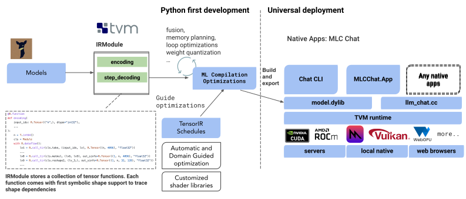

[discord-url]: https://discord.gg/9Xpy2HGBuD

# MLC LLM

| [Project Page](https://mlc.ai/mlc-llm/) | [Blog](https://mlc.ai/blog/2023/05/01/bringing-accelerated-llm-to-consumer-hardware) | [WebLLM](https://mlc.ai/web-llm/) | [WebStableDiffusion](https://mlc.ai/web-stable-diffusion/) | [Discord][discord-url]

MLC LLM is a **universal solution** that allows **any language models** to be **deployed natively** on a diverse set of hardware backends and native applications, plus a **productive framework** for everyone to further optimize model performance for their own use cases.

Our mission is to **enable everyone to develop, optimize and deploy AI models natively on everyone's devices**.

Everything runs locally  with no server support and accelerated with local GPUs on your phone and laptops.
[Supported platforms](https://github.com/mlc-ai/mlc-llm/issues/15) include:
* iPhone, iPad;
* Android phones;
* Apple Silicon and x86 MacBooks;
* AMD, Intel and NVIDIA GPUs via Vulkan on Windows and Linux;
* NVIDIA GPUs via CUDA on Windows and Linux;
* WebGPU on browsers (through companion project [WebLLM](https://github.com/mlc-ai/web-llm/tree/main)).

**[Click here to join our Discord server!][discord-url]**

**[Check out our instruction page to try out!](https://mlc.ai/mlc-llm/)**

<p align="center">
  
</p>

## What is MLC LLM?

In recent years, there has been remarkable progress in generative artificial intelligence (AI) and large language models (LLMs), which are becoming increasingly prevalent. Thanks to open-source initiatives, it is now possible to develop personal AI assistants using open-sourced models. However, LLMs tend to be resource-intensive and computationally demanding. To create a scalable service, developers may need to rely on powerful clusters and expensive hardware to run model inference. Additionally, deploying LLMs presents several challenges, such as their ever-evolving model innovation, memory constraints, and the need for potential optimization techniques.

The goal of this project is to enable the development, optimization, and deployment of AI models for inference across a range of devices, including not just server-class hardware, but also users' browsers, laptops, and mobile apps. To achieve this, we need to address the diverse nature of compute devices and deployment environments. Some of the key challenges include:

- Supporting different models of CPUs, GPUs, and potentially other co-processors and accelerators.
- Deploying on the native environment of user devices, which may not have python or other necessary dependencies readily available.
- Addressing memory constraints by carefully planning allocation and aggressively compressing model parameters.

MLC LLM offers a repeatable, systematic, and customizable workflow that empowers developers and AI system researchers to implement models and optimizations in a productivity-focused, Python-first approach. This methodology enables quick experimentation with new models, new ideas and new compiler passes, followed by native deployment to the desired targets. Furthermore, we are continuously expanding LLM acceleration by broadening TVM backends to make model compilation more transparent and efficient.

## How does MLC Enable Universal Native Deployment?

The cornerstone of our solution is machine learning compilation ([MLC](https://mlc.ai/)), which we leverage to efficiently deploy AI models. We build on the shoulders of open-source ecosystems, including tokenizers from Hugging Face and Google, as well as open-source LLMs like Llama, Vicuna, Dolly, MOSS, RWKV and more. Our primary workflow is based on [Apache TVM Unity](https://github.com/apache/tvm/tree/unity), an exciting ongoing development in the Apache TVM Community.

- Dynamic shape: We bake a language model as a TVM IRModule with native dynamic shape support, avoiding the need for extra padding to the maximum length and reducing both computation amount and memory usage.
- Composable ML compilation optimizations: we perform many model deployment optimizations, such as better compilation code transformation, fusion, memory planning, library offloading and manual code optimization can be easily incorporated as TVM's IRModule transformations exposed as Python APIs.
- Quantization: We utilize low-bit quantizations to compress the model weights and leverage TVM's loop-level TensorIR to quickly customize code generations for different compression encoding schemes.
- Runtime: The final generated libraries run on the native environment, with TVM runtime that comes with minimal dependencies, which supports various GPU driver APIs and native language bindings (C, JavaScript, etc).



Additionally, we also provide a lightweight C++-based example CLI app that showcases how to wrap up the compiled artifacts and necessary pre/post-processing, which will hopefully clarify the workflow to embed them into native applications.

As a starting point, MLC generates GPU shaders for CUDA, Vulkan and Metal. It is possible to add more support, such as OpenCL, sycl, webgpu-native, through improvements to TVM compiler and runtime. MLC also supports various CPU targets including ARM and x86 via LLVM.

We heavily rely on open-source ecosystem, more specifically, [TVM Unity](https://discuss.tvm.apache.org/t/establish-tvm-unity-connection-a-technical-strategy/13344), an exciting latest development in the TVM project that enables python-first interactive MLC development experiences that allows us to easily compose new optimizations all in Python, and incrementally bring our app to the environment of interest. We also leveraged optimizations such as fused quantization kernels, first class dynamic shape support and diverse GPU backends.

## Building from Source

There are two ways to build MLC LLM from source. The first is to use a Hugging Face URL to directly download the model parameters, and the second is to use a local directory that contains the parameters.

### Hugging Face URL

To download the weights from an existing Hugging Face repository for a supported model, you can follow the instructions below:

```shell
# Create a new conda environment and install dependencies
conda create -n mlc-llm-env python
conda activate mlc-llm-env
pip install torch transformers # Install PyTorch and Hugging Face transformers
pip install -I mlc_ai_nightly -f https://mlc.ai/wheels # Install TVM

# Install Git and Git-LFS if you haven't already.
# They are used for downloading the model weights from Hugging Face.
conda install git git-lfs
git lfs install

# Clone the MLC LLM repo
git clone --recursive https://github.com/mlc-ai/mlc-llm.git
cd mlc-llm

# Create the local build directory and compile the model
# This will automatically download the parameters, tokenizer, and config from Hugging Face
python build.py --hf-path=databricks/dolly-v2-3b
```

After a successful build, the compiled model will be available at `dist/dolly-v2-3b-q3f16_0` (the exact path will vary depending on your model type and specified quantization). Follow the platform specific instructions to build and run MLC LLM for [iOS](https://github.com/mlc-ai/mlc-llm/blob/main/ios/README.md), [Android](https://github.com/mlc-ai/mlc-llm/blob/main/android/README.md), and [CLI](https://github.com/mlc-ai/mlc-llm/tree/main/cpp/README.md).

### Local Directory

If you have a local directory that has the model parameters, the tokenizer, and a `config.json` file for a supported model, you can instead run the following build command:

```shell
# Create the local build directory and compile the model
python build.py --model=/path/to/local/directory

# If the model path is in the form of `dist/models/model_name`,
# we can simplify the build command to
# python build.py --model=model_name
```

Similarly, the compiled model will be available at `dist/dolly-v2-3b-q3f16_0`, where the exact path will vary depending on your model type and specified quantization. Follow the platform specific instructions to build and run MLC LLM for [iOS](https://github.com/mlc-ai/mlc-llm/blob/main/ios/README.md), [Android](https://github.com/mlc-ai/mlc-llm/blob/main/android/README.md), and [CLI](https://github.com/mlc-ai/mlc-llm/tree/main/cpp/README.md).

## Links

- You might also be interested in [WebLLM](https://github.com/mlc-ai/web-llm/tree/main), our companion derived project that focus on bringing LLM to browsers.
- Project page for [instructions](site/index.md).
- [Local build Instructions for ios App](ios/README.md).
- You might want to check out our online public [Machine Learning Compilation course](https://mlc.ai) for a systematic
walkthrough of our approaches.

## Acknowledgements

This project is initiated by members from CMU catalyst, UW SAMPL, SJTU, OctoML and the MLC community. We would love to continue developing and supporting the open-source ML community.

This project is only possible thanks to the shoulders open-source ecosystems that we stand on. We want to thank the Apache TVM community and developers of the TVM Unity effort. The open-source ML community members made these models publicly available. PyTorch and Hugging Face communities that make these models accessible. We would like to thank the teams behind Vicuna, SentencePiece, LLaMA, Alpaca, MOSS and RWKV. We also would like to thank the Vulkan, Swift, C++, Python Rust communities that enables this project.
