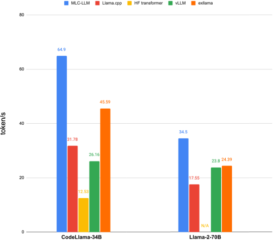
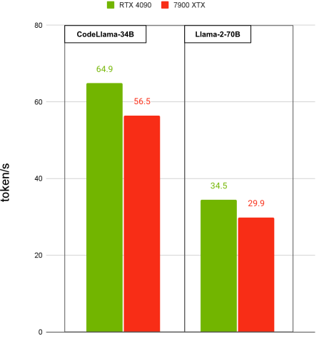
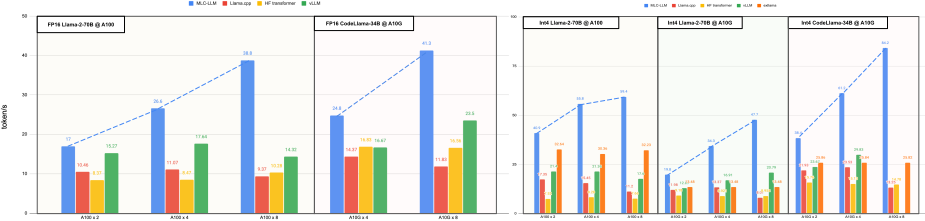

[discord-url]: https://discord.gg/9Xpy2HGBuD

# MLC LLM

[Documentation](https://llm.mlc.ai/docs) | [Blog](https://blog.mlc.ai/) | [Discord][discord-url]

**M**achine **L**earning **C**ompilation for **L**arge **L**anguage **M**odels (MLC LLM) is a high-performance universal deployment solution that allows native deployment of any large language models with native APIs with compiler acceleration. The mission of this project is to enable everyone to develop, optimize and deploy AI models natively on everyone's devices with ML compilation techniques.

**Universal deployment.** MLC LLM supports the following platforms and hardware:

<table style="width:100%">
  <thead>
    <tr>
      <th style="width:15%"> </th>
      <th style="width:20%">AMD GPU</th>
      <th style="width:20%">NVIDIA GPU</th>
      <th style="width:20%">Apple GPU</th>
      <th style="width:24%">Intel GPU</th>
    </tr>
  </thead>
  <tbody>
    <tr>
      <td>Linux / Win</td>
      <td>✅ Vulkan, ROCm</td>
      <td>✅ Vulkan, CUDA</td>
      <td>N/A</td>
      <td>✅ Vulkan</td>
    </tr>
    <tr>
      <td>macOS</td>
      <td>✅ Metal (dGPU)</td>
      <td>N/A</td>
      <td>✅ Metal</td>
      <td>✅ Metal (iGPU)</td>
    </tr>
    <tr>
      <td>Web Browser</td>
      <td colspan=4>✅ WebGPU and WASM </td>
    </tr>
    <tr>
      <td>iOS / iPadOS</td>
      <td colspan=4>✅ Metal on Apple A-series GPU</td>
    </tr>
    <tr>
      <td>Android</td>
      <td colspan=2>✅ OpenCL on Adreno GPU</td>
      <td colspan=2>✅ OpenCL on Mali GPU</td>
    </tr>
  </tbody>
</table>


**Scalable.** MLC LLM scales universally on NVIDIA and AMD GPUs, cloud and gaming GPUs. Below
showcases our single batch decoding performance with prefilling = 1 and decoding = 256.

Performance of 4-bit CodeLlama-34B and Llama2-70B on two NVIDIA RTX 4090 and two AMD Radeon 7900 XTX:
<p float="left">
  
  
</p>

Scaling of fp16 and 4-bit CodeLlama-34 and Llama2-70B on A100-80G-PCIe and A10G-24G-PCIe, up to 8 GPUs:
<p float="center">
  
</p>


## Getting Started

We introduce the quick start examples of chat CLI, Python API and REST server here to use MLC LLM.
We use 4-bit quantized 8B Llama-3 model for demonstration purpose.
The pre-quantized Llama-3 weights is available at https://huggingface.co/mlc-ai/Llama-3-8B-Instruct-q4f16_1-MLC.
You can also try out unquantized Llama-3 model by replacing `q4f16_1` to `q0f16` in the examples below.
Please visit our [documentation](https://llm.mlc.ai/docs/index.html) for detailed quick start and introduction.

### Installation

MLC LLM is available via [pip](https://llm.mlc.ai/docs/install/mlc_llm.html#install-mlc-packages).
It is always recommended to install it in an isolated conda virtual environment.

To verify the installation, activate your virtual environment, run

```bash
python -c "import mlc_llm; print(mlc_llm.__path__)"
```

You are expected to see the installation path of MLC LLM Python package.

### Chat CLI

We can try out the chat CLI in MLC LLM with 4-bit quantized 8B Llama-3 model.

```bash
mlc_llm chat HF://mlc-ai/Llama-3-8B-Instruct-q4f16_1-MLC
```

It may take 1-2 minutes for the first time running this command.
After waiting, this command launch a chat interface where you can enter your prompt and chat with the model.

```
You can use the following special commands:
/help               print the special commands
/exit               quit the cli
/stats              print out the latest stats (token/sec)
/reset              restart a fresh chat
/set [overrides]    override settings in the generation config. For example,
                      `/set temperature=0.5;max_gen_len=100;stop=end,stop`
                      Note: Separate stop words in the `stop` option with commas (,).
Multi-line input: Use escape+enter to start a new line.

user: What's the meaning of life
assistant:
What a profound and intriguing question! While there's no one definitive answer, I'd be happy to help you explore some perspectives on the meaning of life.

The concept of the meaning of life has been debated and...
```

### Python API

We can run the Llama-3 model with the chat completion Python API of MLC LLM.
You can save the code below into a Python file and run it.

```python
from mlc_llm import LLMEngine

# Create engine
model = "HF://mlc-ai/Llama-3-8B-Instruct-q4f16_1-MLC"
engine = LLMEngine(model)

# Run chat completion in OpenAI API.
for response in engine.chat.completions.create(
    messages=[{"role": "user", "content": "What is the meaning of life?"}],
    model=model,
    stream=True,
):
    for choice in response.choices:
        print(choice.delta.content, end="", flush=True)
print("\n")

engine.terminate()
```

**We design the Python API `mlc_llm.LLMEngine` to align with OpenAI API**,
which means you can use LLMEngine in the same way of using
[OpenAI's Python package](https://github.com/openai/openai-python?tab=readme-ov-file#usage)
for both synchronous and asynchronous generation.

In this code example, we use the synchronous chat completion interface and iterate over
all the stream responses.
If you want to run without streaming, you can run

```python
response = engine.chat.completions.create(
    messages=[{"role": "user", "content": "What is the meaning of life?"}],
    model=model,
    stream=False,
)
print(response)
```

You can also try different arguments supported in [OpenAI chat completion API](https://platform.openai.com/docs/api-reference/chat/create).
If you would like to do concurrent asynchronous generation, you can use `mlc_llm.AsyncLLMEngine` instead.

### REST Server

We can launch a REST server to serve the 4-bit quantized Llama-3 model for OpenAI chat completion requests.

```bash
mlc_llm serve HF://mlc-ai/Llama-3-8B-Instruct-q4f16_1-MLC
```

The server is hooked at `http://127.0.0.1:8000` by default, and you can use `--host` and `--port`
to set a different host and port.
When the server is ready (showing `INFO: Uvicorn running on http://127.0.0.1:8000 (Press CTRL+C to quit)`),
we can open a new shell and send a cURL request via the following command:

```bash
curl -X POST \
  -H "Content-Type: application/json" \
  -d '{
        "model": "HF://mlc-ai/Llama-3-8B-Instruct-q4f16_1-MLC",
        "messages": [
            {"role": "user", "content": "Hello! Our project is MLC LLM. What is the name of our project?"}
        ]
  }' \
  http://127.0.0.1:8000/v1/chat/completions
```

The server will process this request and send back the response.
Similar to [Python API](#python-api), you can pass argument ``"stream": true``
to request for stream responses.

## Model Support

MLC LLM supports a wide range of model architectures and variants. We have the following prebuilts which you can
use off-the-shelf. Visit [Prebuilt Models](https://llm.mlc.ai/docs/prebuilt_models.html) to see the full list, and [Compile Models via MLC](https://llm.mlc.ai/docs/compilation/compile_models.html) to see how to use models not on this list.

<table style="width:100%">
  <thead>
    <tr>
      <th style="width:40%">Architecture</th>
      <th style="width:60%">Prebuilt Model Variants</th>
    </tr>
  </thead>
  <tbody>
    <tr>
      <td>Llama</td>
      <td>Llama-3, Code Llama, Vicuna, WizardLM, WizardMath, OpenOrca Platypus2, FlagAlpha Llama-2 Chinese, georgesung Llama-2 Uncensored</td>
    </tr>
    <tr>
      <td>GPT-NeoX</td>
      <td>RedPajama</td>
    </tr>
    <tr>
      <td>GPT-J</td>
      <td></td>
    </tr>
    <tr>
      <td>RWKV</td>
      <td>RWKV-raven</td>
    </tr>
    <tr>
      <td>MiniGPT</td>
      <td></td>
    </tr>
    <tr>
      <td>GPTBigCode</td>
      <td>WizardCoder</td>
    </tr>
    <tr>
      <td>ChatGLM</td>
      <td></td>
    </tr>
    <tr>
      <td>StableLM</td>
      <td></td>
    </tr>
    <tr>
      <td>Mistral</td>
      <td></td>
    </tr>
    <tr>
      <td>Phi</td>
      <td></td>
    </tr>
  </tbody>
</table>

## Universal Deployment APIs

MLC LLM provides multiple sets of APIs across platforms and environments. These include
* [Python API](https://llm.mlc.ai/docs/deploy/python_engine.html)
* [OpenAI-compatible Rest-API](https://llm.mlc.ai/docs/deploy/rest.html)
* [C++ API](https://llm.mlc.ai/docs/deploy/cli.html)
* [JavaScript API](https://llm.mlc.ai/docs/deploy/javascript.html) and [Web LLM](https://github.com/mlc-ai/web-llm)
* [Swift API for iOS App](https://llm.mlc.ai/docs/deploy/ios.html)
* [Java API and Android App](https://llm.mlc.ai/docs/deploy/android.html)

## Citation

Please consider citing our project if you find it useful:

```bibtex
@software{mlc-llm,
    author = {MLC team},
    title = {{MLC-LLM}},
    url = {https://github.com/mlc-ai/mlc-llm},
    year = {2023}
}
```

The underlying techniques of MLC LLM include:

<details>
  <summary>References (Click to expand)</summary>
  
  ```bibtex
  @inproceedings{tensorir,
      author = {Feng, Siyuan and Hou, Bohan and Jin, Hongyi and Lin, Wuwei and Shao, Junru and Lai, Ruihang and Ye, Zihao and Zheng, Lianmin and Yu, Cody Hao and Yu, Yong and Chen, Tianqi},
      title = {TensorIR: An Abstraction for Automatic Tensorized Program Optimization},
      year = {2023},
      isbn = {9781450399166},
      publisher = {Association for Computing Machinery},
      address = {New York, NY, USA},
      url = {https://doi.org/10.1145/3575693.3576933},
      doi = {10.1145/3575693.3576933},
      booktitle = {Proceedings of the 28th ACM International Conference on Architectural Support for Programming Languages and Operating Systems, Volume 2},
      pages = {804–817},
      numpages = {14},
      keywords = {Tensor Computation, Machine Learning Compiler, Deep Neural Network},
      location = {Vancouver, BC, Canada},
      series = {ASPLOS 2023}
  }

  @inproceedings{metaschedule,
      author = {Shao, Junru and Zhou, Xiyou and Feng, Siyuan and Hou, Bohan and Lai, Ruihang and Jin, Hongyi and Lin, Wuwei and Masuda, Masahiro and Yu, Cody Hao and Chen, Tianqi},
      booktitle = {Advances in Neural Information Processing Systems},
      editor = {S. Koyejo and S. Mohamed and A. Agarwal and D. Belgrave and K. Cho and A. Oh},
      pages = {35783--35796},
      publisher = {Curran Associates, Inc.},
      title = {Tensor Program Optimization with Probabilistic Programs},
      url = {https://proceedings.neurips.cc/paper_files/paper/2022/file/e894eafae43e68b4c8dfdacf742bcbf3-Paper-Conference.pdf},
      volume = {35},
      year = {2022}
  }

  @inproceedings{tvm,
      author = {Tianqi Chen and Thierry Moreau and Ziheng Jiang and Lianmin Zheng and Eddie Yan and Haichen Shen and Meghan Cowan and Leyuan Wang and Yuwei Hu and Luis Ceze and Carlos Guestrin and Arvind Krishnamurthy},
      title = {{TVM}: An Automated {End-to-End} Optimizing Compiler for Deep Learning},
      booktitle = {13th USENIX Symposium on Operating Systems Design and Implementation (OSDI 18)},
      year = {2018},
      isbn = {978-1-939133-08-3},
      address = {Carlsbad, CA},
      pages = {578--594},
      url = {https://www.usenix.org/conference/osdi18/presentation/chen},
      publisher = {USENIX Association},
      month = oct,
  }
  ```
</details>

## Links

- You might want to check out our online public [Machine Learning Compilation course](https://mlc.ai) for a systematic
walkthrough of our approaches.
- [WebLLM](https://webllm.mlc.ai/) is a companion project using MLC LLM's WebGPU and WebAssembly backend.
- [WebStableDiffusion](https://websd.mlc.ai/) is a companion project for diffusion models with the WebGPU backend.

