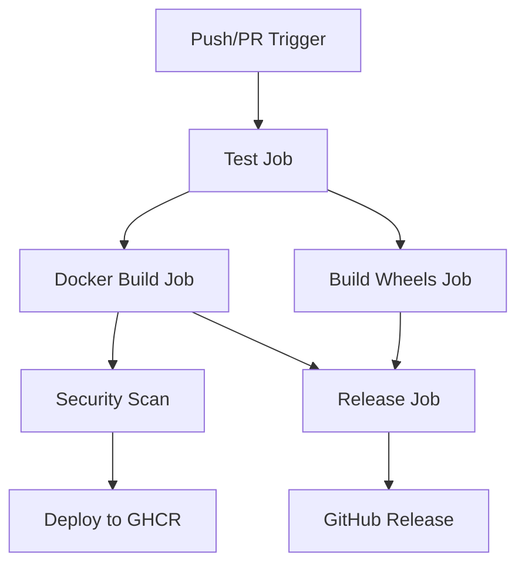

# MLC-LLM Production CI/CD Pipeline Documentation

## Table of Contents

- [Overview](#overview)
- [Prerequisites](#prerequisites)
- [Quick Start](#quick-start)
- [Architecture](#architecture)
- [Docker Images](#docker-images)
- [GitHub Actions Workflows](#github-actions-workflows)
- [Development Environment](#development-environment)
- [Testing Strategy](#testing-strategy)
- [Deployment Guide](#deployment-guide)
- [Troubleshooting](#troubleshooting)

## Overview

This production-quality CI/CD pipeline provides comprehensive automation for the MLC-LLM project, including:

- **Multi-purpose Docker images** for development and production environments
- **Automated testing** with unit, integration, and performance tests
- **Cross-platform builds** for Linux x64 and Windows x64
- **GitHub Container Registry (GHCR)** publishing
- **Automated releases** with Python wheel distribution
- **Security scanning** and vulnerability assessment
- **Performance benchmarking** and monitoring

### Key Features

- 🐳 **Multi-stage Docker builds** with GPU support (CUDA, ROCm, Vulkan)
- 🔄 **Comprehensive CI/CD** with GitHub Actions
- 🧪 **Test-driven development** with pytest framework
- 📦 **Cross-platform wheel building** with cibuildwheel
- 🔒 **Security scanning** with Trivy
- 📊 **Performance monitoring** with Prometheus and Grafana
- 🛠️ **Development tools** with VS Code dev containers

## Prerequisites

### System Requirements

**Minimum Requirements:**
- CPU: 4+ cores
- RAM: 16GB+ (32GB recommended for development)
- Storage: 50GB+ free space
- GPU: Optional but recommended (NVIDIA with CUDA 11.8+)

**Software Dependencies:**
- Docker 20.10+ with BuildKit support
- Docker Compose 2.0+
- Git with Git LFS extension
- Make (for development workflow automation)
- Python 3.9+ (for local development)
- Conda/Miniconda (recommended)

**For GPU Support:**
- NVIDIA Docker runtime (nvidia-docker2)
- CUDA 11.8+ drivers
- Vulkan SDK (for cross-platform GPU support)

### Platform Support

| Platform | Development | Production | CI/CD |
|----------|-------------|------------|-------|
| Linux x64 | ✅ Full | ✅ Full | ✅ Full |
| Windows x64 | ✅ Full | ✅ Full | ✅ Full |
| macOS (Intel) | ⚠️ Limited | ❌ No | ❌ No |
| macOS (Apple Silicon) | ⚠️ Limited | ❌ No | ❌ No |

## Quick Start

### 1. Repository Setup

```bash
# Clone repository with submodules
git clone --recursive https://github.com/mlc-ai/mlc-llm.git
cd mlc-llm

# Set up Git LFS
git lfs install
git lfs pull
```

### 2. Development Environment Setup

**Option A: Using Docker (Recommended)**
```bash
# Copy all provided configuration files to your repository
# Build and start development environment
make dev-setup
make docker-up

# Access Jupyter Lab at http://localhost:8888
# Access TensorBoard at http://localhost:6006
```

**Option B: Using Conda (Native)**
```bash
# Create and activate conda environment
conda env create -f environment-dev.yml
conda activate mlc-dev

# Install pre-commit hooks
make pre-commit-install

# Build MLC-LLM from source
make build
```

### 3. Verify Installation

```bash
# Run quick development environment check
make dev-check

# Run fast tests
make test-fast

# Check Docker images
docker images | grep mlc-llm
```

## Architecture

### System Architecture Diagram

```
┌─────────────────────────────────────────────────────────────┐
│                    MLC-LLM CI/CD Pipeline                   │
├─────────────────────────────────────────────────────────────┤
│  Developer Workflow                                         │
│  ┌─────────────┐  ┌─────────────┐  ┌─────────────┐          │
│  │   VS Code   │──│  Dev Cont.  │──│   Docker    │          │
│  │   + Ext.    │  │   + Tools   │  │   Compose   │          │
│  └─────────────┘  └─────────────┘  └─────────────┘          │
├─────────────────────────────────────────────────────────────┤
│  CI/CD Pipeline (GitHub Actions)                           │
│  ┌─────────────┐  ┌─────────────┐  ┌─────────────┐          │
│  │    Test     │──│    Build    │──│   Deploy    │          │
│  │   - Unit    │  │  - Docker   │  │  - GHCR     │          │
│  │   - Integ   │  │  - Wheels   │  │  - Release  │          │
│  │   - Lint    │  │  - Multi    │  │  - Wheels   │          │
│  └─────────────┘  └─────────────┘  └─────────────┘          │
├─────────────────────────────────────────────────────────────┤
│  Production Environment                                     │
│  ┌─────────────┐  ┌─────────────┐  ┌─────────────┐          │
│  │  Container  │──│ Monitoring  │──│   Scaling   │          │
│  │   Runtime   │  │ Prometheus  │  │ Kubernetes  │          │
│  │   + GPU     │  │  + Grafana  │  │  (Optional) │          │
│  └─────────────┘  └─────────────┘  └─────────────┘          │
└─────────────────────────────────────────────────────────────┘
```

### Container Architecture

The multi-stage Docker build creates optimized images for different use cases:

```dockerfile
# Development Stage (mlc-llm:dev)
├── Base CUDA/ROCm environment
├── All development tools (pytest, black, etc.)
├── Jupyter Lab + TensorBoard
├── Source code mounted as volume
└── Interactive development workflow

# Production Stage (mlc-llm:prod)
├── Minimal runtime environment
├── Compiled MLC-LLM libraries
├── GPU runtime support
└── Optimized for deployment
```

## Docker Images

### Image Variants

| Image Tag | Use Case | Size | Features |
|-----------|----------|------|----------|
| `mlc-llm:dev` | Development | ~8GB | Full toolchain, Jupyter, debugging |
| `mlc-llm:prod` | Production | ~3GB | Runtime only, optimized |
| `mlc-llm:latest` | General use | ~3GB | Same as prod, stable release |

### Building Images

```bash
# Build all images
make build-dev      # Development image
make build-prod     # Production image
make build-multi    # Multi-architecture build

# Build with custom CUDA version
docker build --build-arg CUDA_VERSION=12.1 -t mlc-llm:cuda12.1 .

# Build with ROCm support
docker build --build-arg BASE_IMAGE=rocm/pytorch:rocm6.1_ubuntu22.04 -t mlc-llm:rocm .
```

### Image Usage

**Development Container:**
```bash
# Start development environment
docker run -it --gpus all \
  -v $(pwd):/workspace \
  -p 8888:8888 -p 6006:6006 \
  mlc-llm:dev

# Or use Docker Compose
make docker-up
```

**Production Container:**
```bash
# Run inference server
docker run --gpus all -p 8000:8000 \
  mlc-llm:prod serve --host 0.0.0.0 --port 8000

# Run CLI interface
docker run -it --gpus all \
  mlc-llm:prod chat --model HF://mlc-ai/Llama-2-7b-chat-hf-q4f16_1-MLC
```

## GitHub Actions Workflows

### Workflow Overview

The CI/CD pipeline consists of 5 main jobs that run in parallel and sequence:



### Job Details

#### 1. Test Job (`test`)
- **Trigger:** All pushes and PRs
- **Matrix:** Ubuntu/Windows × Python 3.9/3.10/3.11
- **Duration:** ~15-25 minutes
- **Steps:**
  1. Checkout with submodules and LFS
  2. Setup Python and system dependencies
  3. Configure build environment (CUDA/Vulkan)
  4. Build MLC-LLM from source
  5. Run unit and integration tests
  6. Upload coverage reports

```yaml
# Example test configuration
strategy:
  matrix:
    os: [ubuntu-22.04, windows-latest]
    python-version: ['3.9', '3.10', '3.11']
```

#### 2. Docker Build Job (`docker-build`)
- **Trigger:** After successful tests
- **Platforms:** linux/amd64, linux/arm64
- **Duration:** ~45-60 minutes
- **Features:**
  - Multi-stage builds (development + production)
  - BuildKit caching for faster builds
  - Security scanning with Trivy
  - Automatic GHCR publishing

#### 3. Wheel Building Job (`build-wheels`)
- **Platforms:** Linux x64, Windows x64
- **Python:** 3.9, 3.10, 3.11
- **Tool:** cibuildwheel for consistent builds
- **Output:** Platform-specific wheel files

#### 4. Release Job (`release`)
- **Trigger:** Git tags (v*)
- **Dependencies:** All other jobs
- **Actions:**
  - Create GitHub release
  - Upload wheel artifacts
  - Generate release notes

#### 5. Security Scanning
- **Tool:** Trivy vulnerability scanner
- **Scope:** Docker images, filesystem, dependencies
- **Integration:** GitHub Security tab
- **Frequency:** Every build + scheduled weekly

### Workflow Configuration

Key environment variables and secrets required:

```yaml
# GitHub repository secrets
GITHUB_TOKEN: # Automatic, for GHCR push
CODECOV_TOKEN: # Optional, for coverage reporting

# Environment variables
REGISTRY: ghcr.io
IMAGE_NAME: ${{ github.repository }}
```

### Triggering Workflows

**Automatic Triggers:**
- Push to `main` or `develop` branches
- Pull requests to `main` or `develop`
- Git tags starting with `v` (releases)
- Weekly scheduled builds (Sundays 2 AM UTC)

**Manual Triggers:**
```bash
# Trigger via GitHub CLI
gh workflow run "MLC-LLM CI/CD Pipeline"

# Or via GitHub web interface
# Actions tab → Select workflow → Run workflow
```

## Development Environment

### VS Code Dev Container

The provided `.devcontainer/devcontainer.json` creates a fully configured development environment:

**Features:**
- Pre-installed Python extensions (Black, isort, Pylint, MyPy)
- Jupyter Lab integration
- CMake and C++ tools
- Rust analyzer
- Git LFS support
- GPU access configuration

**Setup:**
1. Install VS Code + Dev Containers extension
2. Open repository in VS Code
3. Click "Reopen in Container" when prompted
4. Wait for container build and setup

### Local Development Workflow

**Daily Development Cycle:**
```bash
# 1. Start development environment
make docker-up

# 2. Open VS Code with dev container
code .

# 3. Make changes, run tests
make test-unit

# 4. Check code quality
make lint
make format

# 5. Commit changes (pre-commit hooks run automatically)
git add .
git commit -m "Your changes"

# 6. Push and create PR
git push origin feature-branch
```

### Development Tools

**Code Quality Tools:**
- **Black:** Python code formatting
- **isort:** Import statement sorting
- **Pylint:** Code linting and analysis
- **MyPy:** Static type checking
- **Pre-commit:** Git hook automation

**Testing Tools:**
- **pytest:** Test framework
- **pytest-cov:** Coverage reporting
- **pytest-xdist:** Parallel test execution

**Development Servers:**
- **Jupyter Lab:** Interactive development (port 8888)
- **TensorBoard:** Training visualization (port 6006)
- **FastAPI:** API development server (port 8000)

## Testing Strategy

### Test Structure

```
tests/
├── conftest.py              # Shared fixtures and configuration
├── unit/                    # Unit tests (fast, isolated)
│   ├── test_engine.py       # MLCEngine functionality
│   ├── test_compiler.py     # Compilation components
│   ├── test_serving.py      # API serving logic
│   └── test_quantization.py # Quantization schemes
├── integration/             # Integration tests (slower, end-to-end)
│   ├── test_end_to_end.py   # Complete workflows
│   ├── test_api_contracts.py # OpenAI API compatibility
│   └── test_multi_platform.py # Cross-platform validation
└── fixtures/                # Test data and models
    ├── models/              # Small test models
    └── datasets/            # Test datasets
```

### Test Categories

**Unit Tests (Fast, <1min total):**
- Engine initialization and configuration
- Model loading and validation
- API request/response handling
- Quantization scheme validation
- Utility functions

**Integration Tests (Slower, 5-10min total):**
- End-to-end inference workflows
- OpenAI API compatibility
- CLI interface testing
- Docker container functionality

**Performance Tests (Optional, 10+ min):**
- Inference speed benchmarking
- Memory usage profiling
- GPU utilization testing
- Concurrent request handling

### Running Tests

```bash
# Run all tests
make test

# Run specific test categories
make test-unit        # Unit tests only
make test-integration # Integration tests only
make test-fast       # Exclude slow tests
make test-gpu        # GPU-specific tests

# Run with coverage
make test-coverage

# Run specific test file
pytest tests/unit/test_engine.py -v

# Run with custom markers
pytest -m "not slow" -v
```

### Test Configuration

Key pytest configuration in `pytest.ini`:
```ini
[tool:pytest]
markers =
    slow: marks tests as slow (deselect with '-m "not slow"')
    integration: marks tests as integration tests
    unit: marks tests as unit tests
    gpu: marks tests requiring GPU
```

### Writing Tests

**Example Unit Test:**
```python
# tests/unit/test_engine.py
import pytest
from mlc_llm import MLCEngine

class TestMLCEngine:
    def test_engine_initialization(self, test_model_path):
        """Test basic engine initialization"""
        engine = MLCEngine(test_model_path)
        assert engine is not None
        engine.terminate()
```

**Example Integration Test:**
```python
# tests/integration/test_end_to_end.py
def test_inference_pipeline(self, test_model_path):
    """Test complete inference pipeline"""
    engine = MLCEngine(test_model_path)
    
    response = engine.chat.completions.create(
        messages=[{"role": "user", "content": "Hello"}],
        model=test_model_path,
        max_tokens=10
    )
    
    assert response is not None
    assert len(response.choices) > 0
    engine.terminate()
```

## Deployment Guide

### GitHub Container Registry (GHCR)

**Automatic Publishing:**
Images are automatically built and pushed to GHCR on:
- Pushes to main branch → `latest` tag
- Git tags → version tags (e.g., `v1.0.0`)
- Pull requests → PR-specific tags

**Manual Publishing:**
```bash
# Login to GHCR
echo $GITHUB_TOKEN | docker login ghcr.io -u $GITHUB_USERNAME --password-stdin

# Build and push
docker build -t ghcr.io/your-org/mlc-llm:custom .
docker push ghcr.io/your-org/mlc-llm:custom
```

**Using Published Images:**
```bash
# Pull latest development image
docker pull ghcr.io/your-org/mlc-llm:latest-dev

# Pull specific version
docker pull ghcr.io/your-org/mlc-llm:v1.0.0

# Run production container
docker run --gpus all -p 8000:8000 \
  ghcr.io/your-org/mlc-llm:latest \
  serve --host 0.0.0.0
```

### Production Deployment

**Docker Compose Production:**
```yaml
# docker-compose.prod.yml
version: '3.8'
services:
  mlc-llm:
    image: ghcr.io/your-org/mlc-llm:latest
    ports:
      - "8000:8000"
    environment:
      - MLC_MODEL_PATH=/models/default
    volumes:
      - ./models:/models:ro
    deploy:
      resources:
        reservations:
          devices:
            - driver: nvidia
              count: 1
              capabilities: [gpu]
    restart: unless-stopped
```

**Kubernetes Deployment:**
```yaml
# k8s-deployment.yaml
apiVersion: apps/v1
kind: Deployment
metadata:
  name: mlc-llm-deployment
spec:
  replicas: 2
  selector:
    matchLabels:
      app: mlc-llm
  template:
    metadata:
      labels:
        app: mlc-llm
    spec:
      containers:
      - name: mlc-llm
        image: ghcr.io/your-org/mlc-llm:latest
        ports:
        - containerPort: 8000
        resources:
          limits:
            nvidia.com/gpu: 1
          requests:
            nvidia.com/gpu: 1
```

### Monitoring and Observability

**Prometheus Metrics:**
The production container exposes metrics at `/metrics` endpoint:
```bash
# Check metrics endpoint
curl http://localhost:8000/metrics
```

**Grafana Dashboards:**
Pre-configured dashboards for:
- Request rate and latency
- GPU utilization
- Memory usage
- Error rates
- Model performance metrics

**Log Management:**
```bash
# View container logs
docker logs mlc-llm-container

# Stream logs
docker logs -f mlc-llm-container

# Structured logging in production
docker run --log-driver=json-file --log-opt max-size=10m \
  ghcr.io/your-org/mlc-llm:latest
```

### Scaling Strategies

**Horizontal Scaling:**
- Load balancer (Nginx/HAProxy)
- Multiple container instances
- Kubernetes HorizontalPodAutoscaler
- GPU resource scheduling

**Vertical Scaling:**
- Increase container resources
- Multiple GPUs per container
- Memory optimization
- CPU core allocation

## Troubleshooting

### Common Issues

**1. Docker Build Failures**

*Error: "CUDA not found"*
```bash
# Solution: Check NVIDIA Docker runtime
docker run --rm --gpus all nvidia/cuda:12.2-runtime-ubuntu22.04 nvidia-smi

# If fails, reinstall nvidia-docker2
sudo apt-get install nvidia-docker2
sudo systemctl restart docker
```

*Error: "Git LFS files not found"*
```bash
# Solution: Install and configure Git LFS
git lfs install
git lfs pull

# Check LFS files
git lfs ls-files
```

**2. Test Failures**

*Error: "ModuleNotFoundError: mlc_llm"*
```bash
# Solution: Install in development mode
cd python && pip install -e .

# Or set PYTHONPATH
export PYTHONPATH=/path/to/mlc-llm/python:$PYTHONPATH
```

*Error: "CUDA out of memory"*
```bash
# Solution: Use smaller model for tests
export MLC_TEST_MODEL="HF://mlc-ai/Llama-2-7b-chat-hf-q4f16_1-MLC"

# Or run CPU-only tests
pytest tests/ -m "not gpu"
```

**3. Development Environment Issues**

*VS Code dev container fails to start*
```bash
# Solution: Rebuild container
docker system prune -f
make docker-rebuild

# Check container logs
docker logs mlc-dev
```

*Pre-commit hooks fail*
```bash
# Solution: Update hooks
pre-commit autoupdate
pre-commit run --all-files

# Skip hooks temporarily
git commit --no-verify
```

**4. CI/CD Pipeline Issues**

*GitHub Actions timeout*
```yaml
# Solution: Increase timeout in workflow
timeout-minutes: 60  # Increase from default 30
```

*Wheel build fails*
```bash
# Solution: Check cibuildwheel configuration
# Update CIBW_* environment variables in workflow
```

### Performance Optimization

**Docker Build Speed:**
```bash
# Use BuildKit cache
export DOCKER_BUILDKIT=1

# Enable cache mounting
docker build --build-arg BUILDKIT_INLINE_CACHE=1

# Use multi-stage build cache
docker build --cache-from=mlc-llm:dev .
```

**Test Execution Speed:**
```bash
# Parallel test execution
pytest -n auto  # Use all CPU cores

# Selective test running
pytest tests/unit/  # Unit tests only
pytest -k "not slow"  # Skip slow tests
```

**Resource Usage:**
```bash
# Monitor GPU usage
nvidia-smi -l 1

# Monitor container resources
docker stats

# Check memory usage
docker run --memory=8g mlc-llm:prod
```

### Getting Help

**Documentation:**
- [MLC-LLM Official Docs](https://llm.mlc.ai/docs)
- [Docker Documentation](https://docs.docker.com)
- [GitHub Actions Documentation](https://docs.github.com/en/actions)

**Community:**
- GitHub Issues: Report bugs and feature requests
- GitHub Discussions: Ask questions and share ideas
- Discord/Slack: Real-time community support

**Development:**
```bash
# Enable debug logging
export MLC_DEBUG=1

# Run with verbose output
make test-unit -v

# Check system information
make dev-check
```

## Best Practices

### Security

1. **Container Security:**
   - Use non-root users in containers
   - Scan images for vulnerabilities
   - Keep base images updated
   - Minimize image surface area

2. **CI/CD Security:**
   - Use GitHub secrets for sensitive data
   - Enable branch protection rules
   - Require signed commits
   - Regular dependency updates

3. **Code Security:**
   - Run Bandit security linter
   - Use pre-commit hooks
   - Regular security audits
   - Dependency vulnerability scanning

### Performance

1. **Build Optimization:**
   - Multi-stage Docker builds
   - BuildKit cache utilization
   - Parallel compilation
   - Layer caching strategies

2. **Runtime Optimization:**
   - GPU memory management
   - Model quantization
   - Batch processing
   - Connection pooling

3. **Testing Optimization:**
   - Parallel test execution
   - Test categorization
   - Fixture reuse
   - Mock external dependencies

### Maintenance

1. **Regular Updates:**
   - Dependency updates
   - Base image updates
   - Security patches
   - Documentation updates

2. **Monitoring:**
   - Performance metrics
   - Error tracking
   - Resource utilization
   - User feedback

3. **Documentation:**
   - Keep README updated
   - Document breaking changes
   - Maintain changelog
   - Update examples

---

This documentation provides a complete guide for implementing and maintaining the MLC-LLM CI/CD pipeline. For specific implementation details, refer to the individual configuration files provided in the artifacts.


<div align="center">

# MLC LLM

[](https://llm.mlc.ai/docs/)
[](https://github.com/mlc-ai/mlc-llm/blob/main/LICENSE)
[](https://discord.gg/9Xpy2HGBuD)
[](https://github.com/mlc-ai/web-llm/)

**Universal LLM Deployment Engine with ML Compilation**

[Get Started](https://llm.mlc.ai/docs/get_started/quick_start) | [Documentation](https://llm.mlc.ai/docs) | [Blog](https://blog.mlc.ai/)

</div>

## About

MLC LLM is a machine learning compiler and high-performance deployment engine for large language models.  The mission of this project is to enable everyone to develop, optimize, and deploy AI models natively on everyone's platforms. 

<div align="center">
<table style="width:100%">
  <thead>
    <tr>
      <th style="width:15%"> </th>
      <th style="width:20%">AMD GPU</th>
      <th style="width:20%">NVIDIA GPU</th>
      <th style="width:20%">Apple GPU</th>
      <th style="width:24%">Intel GPU</th>
    </tr>
  </thead>
  <tbody>
    <tr>
      <td>Linux / Win</td>
      <td>✅ Vulkan, ROCm</td>
      <td>✅ Vulkan, CUDA</td>
      <td>N/A</td>
      <td>✅ Vulkan</td>
    </tr>
    <tr>
      <td>macOS</td>
      <td>✅ Metal (dGPU)</td>
      <td>N/A</td>
      <td>✅ Metal</td>
      <td>✅ Metal (iGPU)</td>
    </tr>
    <tr>
      <td>Web Browser</td>
      <td colspan=4>✅ WebGPU and WASM </td>
    </tr>
    <tr>
      <td>iOS / iPadOS</td>
      <td colspan=4>✅ Metal on Apple A-series GPU</td>
    </tr>
    <tr>
      <td>Android</td>
      <td colspan=2>✅ OpenCL on Adreno GPU</td>
      <td colspan=2>✅ OpenCL on Mali GPU</td>
    </tr>
  </tbody>
</table>
</div>

MLC LLM compiles and runs code on MLCEngine -- a unified high-performance LLM inference engine across the above platforms. MLCEngine provides OpenAI-compatible API available through REST server, python, javascript, iOS, Android, all backed by the same engine and compiler that we keep improving with the community.

## Get Started

Please visit our [documentation](https://llm.mlc.ai/docs/) to get started with MLC LLM.
- [Installation](https://llm.mlc.ai/docs/install/mlc_llm)
- [Quick start](https://llm.mlc.ai/docs/get_started/quick_start)
- [Introduction](https://llm.mlc.ai/docs/get_started/introduction)

## Citation

Please consider citing our project if you find it useful:

```bibtex
@software{mlc-llm,
    author = {{MLC team}},
    title = {{MLC-LLM}},
    url = {https://github.com/mlc-ai/mlc-llm},
    year = {2023-2025}
}
```

The underlying techniques of MLC LLM include:

<details>
  <summary>References (Click to expand)</summary>

  ```bibtex
  @inproceedings{tensorir,
      author = {Feng, Siyuan and Hou, Bohan and Jin, Hongyi and Lin, Wuwei and Shao, Junru and Lai, Ruihang and Ye, Zihao and Zheng, Lianmin and Yu, Cody Hao and Yu, Yong and Chen, Tianqi},
      title = {TensorIR: An Abstraction for Automatic Tensorized Program Optimization},
      year = {2023},
      isbn = {9781450399166},
      publisher = {Association for Computing Machinery},
      address = {New York, NY, USA},
      url = {https://doi.org/10.1145/3575693.3576933},
      doi = {10.1145/3575693.3576933},
      booktitle = {Proceedings of the 28th ACM International Conference on Architectural Support for Programming Languages and Operating Systems, Volume 2},
      pages = {804–817},
      numpages = {14},
      keywords = {Tensor Computation, Machine Learning Compiler, Deep Neural Network},
      location = {Vancouver, BC, Canada},
      series = {ASPLOS 2023}
  }

  @inproceedings{metaschedule,
      author = {Shao, Junru and Zhou, Xiyou and Feng, Siyuan and Hou, Bohan and Lai, Ruihang and Jin, Hongyi and Lin, Wuwei and Masuda, Masahiro and Yu, Cody Hao and Chen, Tianqi},
      booktitle = {Advances in Neural Information Processing Systems},
      editor = {S. Koyejo and S. Mohamed and A. Agarwal and D. Belgrave and K. Cho and A. Oh},
      pages = {35783--35796},
      publisher = {Curran Associates, Inc.},
      title = {Tensor Program Optimization with Probabilistic Programs},
      url = {https://proceedings.neurips.cc/paper_files/paper/2022/file/e894eafae43e68b4c8dfdacf742bcbf3-Paper-Conference.pdf},
      volume = {35},
      year = {2022}
  }

  @inproceedings{tvm,
      author = {Tianqi Chen and Thierry Moreau and Ziheng Jiang and Lianmin Zheng and Eddie Yan and Haichen Shen and Meghan Cowan and Leyuan Wang and Yuwei Hu and Luis Ceze and Carlos Guestrin and Arvind Krishnamurthy},
      title = {{TVM}: An Automated {End-to-End} Optimizing Compiler for Deep Learning},
      booktitle = {13th USENIX Symposium on Operating Systems Design and Implementation (OSDI 18)},
      year = {2018},
      isbn = {978-1-939133-08-3},
      address = {Carlsbad, CA},
      pages = {578--594},
      url = {https://www.usenix.org/conference/osdi18/presentation/chen},
      publisher = {USENIX Association},
      month = oct,
  }
  ```
</details>
